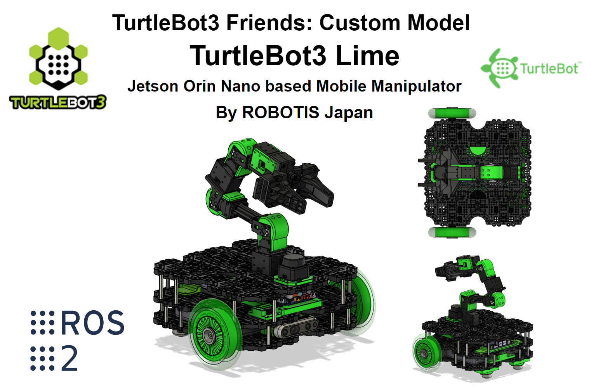

# TurtleBot3 Friends: Lime


## Gazebo環境での動作検証

|                     Gazebo環境 + Rviz                      |
| :--------------------------------------------------------: |
|  |


## セットアップ手順（Quick Start Guide）

Limeのベースである[TurtleBot3 with OpenMANIPULATOR](https://emanual.robotis.com/docs/en/platform/turtlebot3/manipulation/)から変更点があります．以下の手順を参考にしてください．

### 1. Jetson Orin Nano の環境設定

#### 1.1. Jetson Orin Nano のセットアップについて

Turtlebot3 Limeを利用するには，Jetson Orin NanoにJetpack 6.xをインストールする必要があります．

1. Ubuntu 22.04がインストールされたPC（以下，リモートPC）を用意してください．
2. [SDK Manager](https://developer.nvidia.com/sdk-manager)をインストールしてください．
3. [公式のインストールガイド](https://docs.nvidia.com/sdk-manager/install-with-sdkm-jetson/index.html)に従って，Jetpack 6.xをインストールしてください．

#### 1.2. ROS 2 Humble のインストール

[ROS 公式のインストールガイド](https://docs.ros.org/en/humble/Installation/Ubuntu-Install-Debians.html)に従って，ROS 2 Humbleをインストールします．

まず，Ubuntu Universe リポジトリが有効になっていることを確認します．
```
$ sudo apt install -y software-properties-common
$ sudo add-apt-repository universe
```

ROS 2 Humbleをインストールします．
```
$ sudo apt update && sudo apt -y install curl gnupg lsb-release
$ sudo curl -sSL https://raw.githubusercontent.com/ros/rosdistro/master/ros.key -o /usr/share/keyrings/ros-archive-keyring.gpg
$ echo "deb [arch=$(dpkg --print-architecture) signed-by=/usr/share/keyrings/ros-archive-keyring.gpg] http://packages.ros.org/ros2/ubuntu $(. /etc/os-release && echo $UBUNTU_CODENAME) main" | sudo tee /etc/apt/sources.list.d/ros2.list > /dev/null
$ sudo apt update
$ sudo apt install -y ros-humble-desktop
$ echo "source /opt/ros/humble/setup.bash" >> ~/.bashrc
$ source ~/.bashrc
$ sudo apt install -y python3-colcon-common-extensions python3-pip
```

ワークスペースを作成します．
```
$ mkdir -p ~/turtlebot3_ws/src
$ cd ~/turtlebot3_ws && colcon build --symlink-install && . install/setup.bash
```
ワークスペースやROS_DOMAINを設定します．
```
$ echo '. ~/turtlebot3_ws/install/setup.bash' >> ~/.bashrc
$ echo 'export ROS_DOMAIN_ID=30 #TURTLEBOT3' >> ~/.bashrc
$ source ~/.bashrc
```

#### 1.3. Intel RealSense SDK 2.0のインストール

Intel RealSense SDK 2.0でCUDAを有効化するために，Jetson Orin Nanoでビルドしてインストールします．
```
$ sudo apt install -y git libssl-dev libusb-1.0-0-dev pkg-config libgtk-3-dev
$ cd ~/Downloads/
$ git clone https://github.com/IntelRealSense/librealsense.git -b v2.55.1
$ cd ./librealsense/
$ sudo cp config/99-realsense-libusb.rules /etc/udev/rules.d/
$ sudo cp config/99-realsense-d4xx-mipi-dfu.rules /etc/udev/rules.d/
$ sudo udevadm control --reload-rules && sudo udevadm trigger
$ mkdir build && cd build
$ cmake .. -DBUILD_EXAMPLES=true -DCMAKE_BUILD_TYPE=release -DFORCE_RSUSB_BACKEND=true -DBUILD_WITH_CUDA=true && make -j$(($(nproc)-1)) && sudo make install
```

#### 1.4. Realsense D435i のセットアップ

Realsense D435i内部のファームウェアのバージョンをIntel RealSense SDK 2.0のバージョンと合わせる必要があります．

Realsense D435iを Jetson Orin Nano を通して，セットアップを行います．
```
$ cd ~/Downloads/ && curl -sSL --output ./Signed_Image_UVC_5_16_0_1.zip https://www.intelrealsense.com/download/23422/?tmstv=1713899242
$ unzip ./Signed_Image_UVC_5_16_0_1.zip
$ cd ./Signed_Image_UVC_5_16_0_1/
$ rs-fw-update -f ./Signed_Image_UVC_5_16_0_1.bin
```

#### 1.5. realsense-rosのインストール

ROSでIntel Realsense SDK 2.0を読み込むために，realsense-rosをインストールします．

```
$ cd ~/turtlebot3_ws/src
$ git clone https://github.com/IntelRealSense/realsense-ros -b 4.55.1
$ cd ~/turtlebot3_ws
$ sudo apt install -y python3-rosdep
$ sudo rosdep init
$ rosdep update
```

一度，ターミナルに入り直してください．
```
$ cd ~/turtlebot3_ws
$ rosdep install -i --from-path src --rosdistro $ROS_DISTRO --skip-keys=librealsense2 -y
$ cd ~/turtlebot3_ws && colcon build --symlink-install && . install/setup.bash
```

#### 1.6. その他の必要なROS2パッケージのインストール

その他の必要なROS2パッケージをインストールします．
```
$ sudo apt install -y ros-humble-cartographer ros-humble-cartographer-ros ros-humble-navigation2 ros-humble-nav2-bringup ros-humble-dynamixel-sdk ros-humble-ros2-control ros-humble-ros2-controllers ros-humble-gripper-controllers ros-humble-moveit ros-humble-moveit-servo
$ cd ~/turtlebot3_ws/src
$ git clone -b humble-devel https://github.com/ROBOTIS-JAPAN-GIT/turtlebot3_lime.git
$ git clone https://github.com/ldrobotSensorTeam/ldlidar_stl_ros2.git
$ cd ~/turtlebot3_ws && colcon build --symlink-install && . install/setup.bash
```

#### 1.7. OpenCRに権限を付与する

OpenCRと通信するために，権限を付与します．

```
$ sudo curl -sSL https://raw.githubusercontent.com/ROBOTIS-GIT/turtlebot3/humble-devel/turtlebot3_bringup/script/99-turtlebot3-cdc.rules -o /etc/udev/rules.d/99-turtlebot3-cdc.rules
$ sudo udevadm control --reload-rules
$ sudo udevadm trigger
```

#### 1.8. OpenCRのセットアップ

OpenCRを Jetson Orin Nano を通して，セットアップを行います

```
$ sudo dpkg --add-architecture armhf
$ sudo apt update
$ sudo apt install -y libc6:armhf
$ export OPENCR_PORT=/dev/ttyACM0
$ export OPENCR_MODEL=lime
$ cd ~/Downloads/
$ rm -rf ./opencr_update.tar.bz2
$ wget https://github.com/ROBOTIS-JAPAN-GIT/OpenCR_jp_custom/releases/download/ros2v1.0.1/opencr_update_jp_custom.tar.bz2
$ tar -xvf opencr_update_jp_custom.tar.bz2
$ cd ./opencr_update
$ ./update.sh $OPENCR_PORT $OPENCR_MODEL.opencr
```

### 2. リモートPCの環境設定

#### 2.1. リモートPC のセットアップについて

リモートPC側にも必要なROS 2パッケージや，ドライバをインストールする必要があります．

#### 2.2. ROS 2 Humbleのインストール

- ROS 2 がインストールされている場合

    ワークスペースを作成します．
    ```
    $ mkdir -p ~/turtlebot3_ws/src
    $ cd ~/turtlebot3_ws && colcon build --symlink-install && . install/setup.bash
    ```
    ワークスペースやROS_DOMAINを設定します．
    ```
    $ echo '. ~/turtlebot3_ws/install/setup.bash' >> ~/.bashrc
    $ echo 'export ROS_DOMAIN_ID=30 #TURTLEBOT3' >> ~/.bashrc
    $ source ~/.bashrc
    ```


- ROS 2 がインストールされていない場合
    <details>
  
    <summary><a href="#12-ros-2-humble-のインストール">1.2. ROS 2 Humble のインストール</a>と同様です．</summary>
    <a href="[#12-ros-2-humble-のインストール](https://docs.ros.org/en/humble/Installation/Ubuntu-Install-Debians.html))">ROS 公式のインストールガイド</a>に従って，ROS 2 Humbleをインストールします．
    まず，Ubuntu Universe リポジトリが有効になっていることを確認します．
    ```
    $ sudo apt install -y software-properties-common
    $ sudo add-apt-repository universe
    ```

    ROS 2 Humbleをインストールします．
    ```
    $ sudo apt update && sudo apt -y install curl gnupg lsb-release
    $ sudo curl -sSL https://raw.githubusercontent.com/ros/rosdistro/master/ros.key -o /usr/share/keyrings/ros-archive-keyring.gpg
    $ echo "deb [arch=$(dpkg --print-architecture) signed-by=/usr/share/keyrings/ros-archive-keyring.gpg] http://packages.ros.org/ros2/ubuntu $(. /etc/os-release && echo $UBUNTU_CODENAME) main" | sudo tee /etc/apt/sources.list.d/ros2.list > /dev/null
    $ sudo apt update
    $ sudo apt install -y ros-humble-desktop
    $ echo "source /opt/ros/humble/setup.bash" >> ~/.bashrc
    $ source ~/.bashrc
    $ sudo apt install -y python3-colcon-common-extensions python3-pip
    ```

    ワークスペースを作成します．
    ```
    $ mkdir -p ~/turtlebot3_ws/src
    $ cd ~/turtlebot3_ws && colcon build --symlink-install && . install/setup.bash
    ```
    ワークスペースやROS_DOMAINを設定します．
    ```
    $ echo '. ~/turtlebot3_ws/install/setup.bash' >> ~/.bashrc
    $ echo 'export ROS_DOMAIN_ID=30 #TURTLEBOT3' >> ~/.bashrc
    $ source ~/.bashrc
    ```
    </details>

#### 2.3. その他の必要なROS2パッケージのインストール

その他の必要なROS2パッケージをインストールします．
```
$ sudo apt update 
$ sudo apt install -y ros-humble-cartographer ros-humble-cartographer-ros ros-humble-navigation2 ros-humble-nav2-bringup ros-humble-dynamixel-sdk ros-humble-ros2-control ros-humble-ros2-controllers ros-humble-gripper-controllers ros-humble-moveit ros-humble-moveit-servo ros-humble-gazebo-* ros-humble-realsense2-camera-msgs ros-humble-realsense2-description
$ cd ~/turtlebot3_ws/src
$ git clone -b humble-devel https://github.com/ROBOTIS-JAPAN-GIT/turtlebot3_lime.git
$ git clone -b foxy-devel https://github.com/pal-robotics/realsense_gazebo_plugin.git
$ cd ~/turtlebot3_ws && colcon build --symlink-install && . install/setup.bash
```

Gazeboのセットアップを毎回読み込むように設定します．
```
$ echo 'source /usr/share/gazebo/setup.sh' >> ~/.bashrc
$ source ~/.bashrc
```

### 3. 実機での動かし方

#### 3.1. セットアップ（この操作は，動かす際に必ず行ってください）

**必ず，Jetson Orin NanoとリモートPCの時刻を同期してください．両方をインターネットに接続すれば，時刻が同期されます．**

Jetson Orin Nanoにssh接続して，ドライバを立ち上げます．
```
$ ros2 launch turtlebot3_lime_bringup hardware.launch.py
```

**moveit実行中にbringupを終了しないでください．中断する場合は先にmoveitを終了してください．**

リモートPCでドライバを実行します．
```
$ ros2 launch turtlebot3_lime_moveit_config servo.launch.py
```

#### 3.2. 地図を作る (SLAM)

リモートPC側でSLAMを立ち上げます．
```
$ ros2 launch turtlebot3_lime_cartographer cartographer.launch.py
```

リモートPC側でテレオペを実行します．
```
$ ros2 run turtlebot3_lime_teleop turtlebot3_lime_teleop
```

リモートPC側でマップを保存します．
```
$ ros2 run nav2_map_server map_saver_cli -f ~/map
```

#### 3.3. Navigation 2

リモートPCでNavigation 2を実行します．
```
$ ros2 launch turtlebot3_lime_navigation2 navigation2.launch.py map_yaml_file:=$HOME/map.yaml
```

#### 3.4. Moveit 2

リモートPCでMoveit 2を実行します．

```
$ ros2 launch turtlebot3_lime_moveit_config moveit_core.launch.py
```

#### 3.5. Navigation 2 と Moveit 2 を同時に実行する

リモートPCで以下のコマンドを実行します．
```
$ ros2 launch turtlebot3_lime_bringup moveit_navigation.launch.py map_yaml_file:=$HOME/map.yaml
```

#### 3.6. Realsense D435i のドライバを実行する

Jetson Orin Nanoにssh接続して，ドライバを立ち上げます．
```
$ ros2 launch realsense2_camera rs_launch.py
```

### 4. シミュレーションの動かし方

#### 4.1. セットアップ

この操作は，動かす際に全てリモートPCで行ってください．

Gazeboを立ち上げます．
```
$ ros2 launch turtlebot3_lime_bringup gazebo.launch.py
```

ドライバを立ち上げます．
```
$ ros2 launch turtlebot3_lime_moveit_config servo.launch.py use_sim:=true
```

#### 4.2. 地図を作る (SLAM)


SLAMを立ち上げます．
```
$ ros2 launch turtlebot3_lime_cartographer cartographer.launch.py use_sim:=true
```

テレオペを立ち上げます．
```
$ ros2 run turtlebot3_lime_teleop turtlebot3_lime_teleop
```

マップを保存します．
```
$ ros2 run nav2_map_server map_saver_cli -f ~/map
```

#### 4.3. Navigation 2


Navigation 2を実行します．
```
$ ros2 launch turtlebot3_lime_navigation2 navigation2_use_sim_time.launch.py map_yaml_file:=$HOME/map.yaml
```

#### 4.4. Moveit 2


Moveit 2を実行します．
```
$ ros2 launch turtlebot3_lime_moveit_config moveit_core.launch.py use_sim:=true
```

#### 4.5. Navigation 2 と Moveit 2 を同時に実行する


以下のコマンドを実行します．
```
$ ros2 launch turtlebot3_lime_bringup moveit_navigation_use_sim_time.launch.py map_yaml_file:=$HOME/map.yaml
```


## TurtleBot3 with OpenMANIPULATORのROBOTIS e-Manual 
- [TurtleBot3 with OpenMANIPULATOR](https://emanual.robotis.com/docs/en/platform/turtlebot3/manipulation/) 

## TurtleBot3に関するオープンソース関連 
- [turtlebot3_manipulation](https://github.com/ROBOTIS-GIT/turtlebot3_manipulation/tree/humble-devel)
- [turtlebot3](https://github.com/ROBOTIS-GIT/turtlebot3)
- [turtlebot3_jp_custom](https://github.com/ROBOTIS-JAPAN-GIT/turtlebot3_jp_custom)
- [turtlebot3_msgs](https://github.com/ROBOTIS-GIT/turtlebot3_msgs)
- [turtlebot3_simulations](https://github.com/ROBOTIS-GIT/turtlebot3_simulations)
- [turtlebot3_simulations_jp_custom](https://github.com/ROBOTIS-JAPAN-GIT/turtlebot3_simulations_jp_custom)
- [dynamixel_sdk](https://github.com/ROBOTIS-GIT/DynamixelSDK)
- [OpenCR-Hardware](https://github.com/ROBOTIS-GIT/OpenCR-Hardware)
- [OpenCR](https://github.com/ROBOTIS-GIT/OpenCR)

## TurtleBot3に関するドキュメントと動画
- [ROBOTIS e-Manual for TurtleBot3 with OpenMANIPULATOR](https://emanual.robotis.com/docs/en/platform/turtlebot3/manipulation/) 
- [ROBOTIS e-Manual for TurtleBot3](http://turtlebot3.robotis.com/)
- [ROBOTIS e-Manual for Dynamixel SDK](http://emanual.robotis.com/docs/en/software/dynamixel/dynamixel_sdk/overview/)
- [Website for TurtleBot Series](http://www.turtlebot.com/)
- [e-Book for TurtleBot3](https://community.robotsource.org/t/download-the-ros-robot-programming-book-for-free/51/)
- [Videos for TurtleBot3](https://www.youtube.com/playlist?list=PLRG6WP3c31_XI3wlvHlx2Mp8BYqgqDURU)
